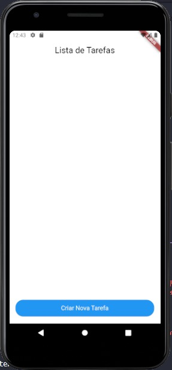
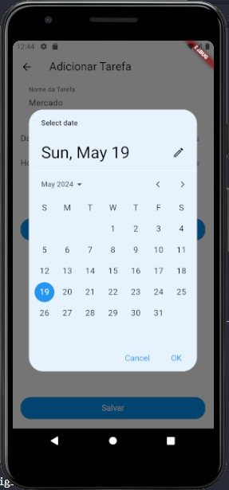
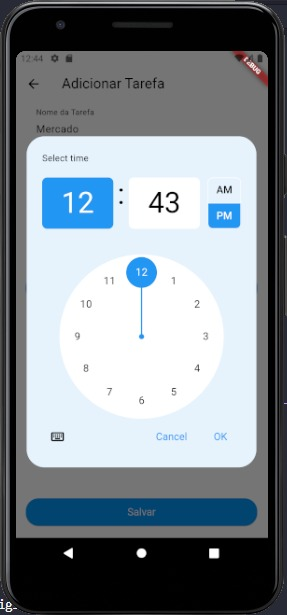
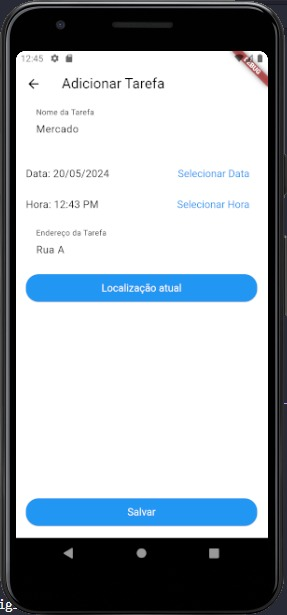
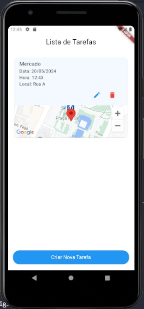

# App de Tarefas

Este é um aplicativo Flutter para gerenciar uma lista de tarefas. Ele permite criar, editar, excluir e listar tarefas. As tarefas podem ser armazenadas em memória, sem necessidade de persistência em banco de dados.

## Funcionalidades

- Adicionar nova tarefa
- Editar tarefa existente
- Excluir tarefa
- Listar tarefas
- Visualizar a localização da tarefa no mapa

## Cada tarefa contém

- Nome
- Data e hora
- Geolocalização (endereço)

## Capturas de Tela







## Como Executar

1. Clone este repositório
   ```sh
   git clone https://github.com/Markos-Vini/first_app_flutter.git

2. Navegue até o diretório do projeto
    cd seu-repositorio.

3. Instale as dependências
    flutter pub get

4. Execute o aplicativo
    flutter run

## Tecnologias Utilizadas
    * Flutter.
    * Google Maps API
    * Geocoding
    * Geolocator 

## Autor
    Marcos Evaristo

       